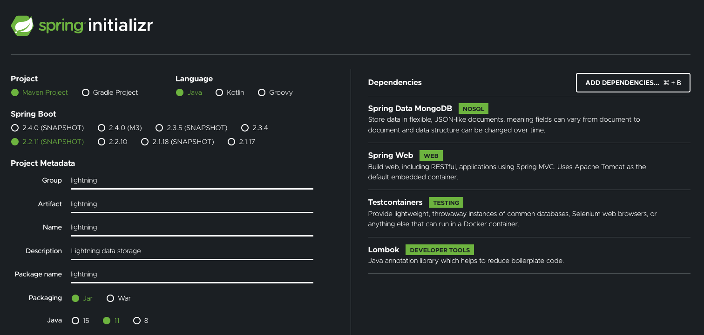

# Apache Beam streaming in a Spring Boot application. Use case.
In this blog post I'll write a simple Spring Boot application using Apache Beam to stream data (with Apache Flink under the hood) from Apache Kafka to MongoDB and expose endpoints providing real-time data. The application will simulate a data center that receives data about lightnings around the world from a Kafka instance.

It will expose 2 endpoints: one that returns up-to-date data about received lightnings and the second one that returns how many lightnings stroke the ground in one minute time range.

I will also write an emulator that will simulate the detectors that receive the lightning and send the data to a Kafka instance.

All the data processing will be executed via Apache Beam with Apache Flink as the runner. The endpoints will use Spring Data repositories which is a super convenient tool for this NoSQL database integration.

If you are not familiar with Spring Boot I encourage you to read Michal's great [Spring Boot article](https://www.polidea.com/blog/what-is-spring-boot-first-steps-with-spring/). To learn more about Apache Beam I recommend Kamil's [Apache Beam Tutorial](https://www.polidea.com/blog/apache-beam-tutorial-and-beginners-guide/) and [Apache Beam Quickstart](https://beam.apache.org/get-started/quickstart-java/).

## Setting things up

At first I want to use Spring Boot. I will use Spring Initializr so I can easily start with a ready-to-go project.



I usually use Gradle but for this simple project I've chosen Maven as the build tool - it's popular and simple. I'll not do any magic here so it's perfectly sufficient.

Next, I checked Spring Boot version 2.2.11 because the Apache Beam's MongoDB IO uses Mongo Java driver 3. The later versions of Spring Data MongoDB use Mongo Java Driver 4 so for now they are not compatible.

Some additional dependencies are needed:
- Spring Web to be able to expose REST endpoints with an embedded Tomcat container
- Spring Data MongoDB for an integration with MongoDB
- Lombok to reduce lots of boilerplate code.
- I will use Testcontainers to easily perform integration tests on the real Apache Kafka and MongoDB instances. I will bump its version from 1.14.3 to the fresh 1.15.0.

I will not use Spring for Apache Kafka - Beam will handle everything for us. I'll write some producer code ourselves to test our Beans with Beam pipeline but that's all. I added the 2.6.0 of kafka-clients dependency:
```xml
<dependency>
    <groupId>org.apache.kafka</groupId>
    <artifactId>kafka-clients</artifactId>
    <version>2.6.0</version>
</dependency>
```

Also, Apache Beam dependencies are needed too. They can be found in mvnrepository. 
```xml
<dependency>
    <groupId>org.apache.beam</groupId>
    <artifactId>beam-runners-flink-1.10</artifactId>
    <version>2.24.0</version>
</dependency>
```
I want to use Flink for actual data processing under the hood. Beam makes it easy to swap underlying data processing engines. If I changed my mind and wanted to use Dataflow or Spark then I just need to change this dependency and PipelineOptions (later in this article).

```xml
<dependency>
    <groupId>org.apache.beam</groupId>
    <artifactId>beam-sdks-java-io-kafka</artifactId>
    <version>2.24.0</version>
</dependency>
```
I also want to be able to read and write from Kafka, so I need this Beam IO dependency.

```xml
<dependency>
    <groupId>org.apache.beam</groupId>
    <artifactId>beam-sdks-java-io-mongodb</artifactId>
    <version>2.24.0</version>
</dependency>
```
Same, for the ability to write to MongoDB.

Right now our app contains all the needed dependencies and a simple Java class LightningApplication.

### Set the Apache Kafka and MongoDB instances

The Lightning app will connect to Apache Kafka and MongoDB. They can be easily set using Docker Compose:
```yml
version: '3.7'

services:
  zookeeper:
    image: bitnami/zookeeper:3.6.2
    container_name: lightning_zookeeper
    ports:
      - '2181:2181'
    environment:
      - ALLOW_ANONYMOUS_LOGIN=yes

  kafka:
    image: bitnami/kafka:2.6.0
    container_name: lightning_kafka
    links:
      - zookeeper:zookeeper
    ports:
      - '9092:9092'
    environment:
      - KAFKA_CFG_ZOOKEEPER_CONNECT=zookeeper:2181
      - KAFKA_CFG_ADVERTISED_LISTENERS=PLAINTEXT://localhost:9092
      - ALLOW_PLAINTEXT_LISTENER=yes
    depends_on:
      - zookeeper

  mongo:
    image: mongo:4.4.1
    container_name: lightning_mongo
    ports:
      - '27017:27017'
    environment:
      - MONGO_INITDB_DATABASE=lightning_db
```
This docker-compose file sets up an Apache Kafka linked with Apache Zookeeper and a MongoDB instances.

### Spring Boot app configuration

Now get back to the app. Here are all the needed configurations for application.yml:
```yml
mongo:
  host: mongodb://localhost:27017
  database: lightning_db
  collection:
    lightnings: lightnings
    strikes: strikes
beam:
  window:
    size: 60

kafka:
  bootstrap:
    servers: localhost:9092
  topic: lightning_topic
  auto:
    offset:
      reset: latest

spring:
  profiles:
    active: withEmulator
```
Here I define mongo, beam and kafka environment properties so the app will have one source of truth. It's in Yaml file format that is way more readable than .properties files. Spring supports both formats.


```java
@Configuration
@EnableAsync
public class LightningConfiguration {
  @Bean
  public Executor taskExecutor() {
    ThreadPoolTaskExecutor executor = new ThreadPoolTaskExecutor();
    executor.setCorePoolSize(4);
    executor.setMaxPoolSize(4);
    executor.setQueueCapacity(2);
    executor.setThreadNamePrefix("Lightning-");
    executor.initialize();
    return executor;
  }

  @Bean
  public PipelineOptions pipelineOptions() {
    PipelineOptions options = PipelineOptionsFactory.create();
    options.setRunner(FlinkRunner.class);
    return options;
  }
}
```

Flink streaming pipelines in Beam are blocking operations so they will need to be run in a separate thread. To do so I'll create an Executor Bean with Lightning prefix for its Threads.

In this configuration class I'll also define a Bean with Apache Beam's PipelineOptions that can be used across all the application. I will set just one parameter to use an embedded FlinkRunner. It starts Flink Master and job server automatically.

But you can also use Beam with an external Flink instance. You can read more about that at [Beam flink runner documentation](https://beam.apache.org/documentation/runners/flink/).

There is no need to specify whether it's a streaming or batch pipeline. Beam will handle it automatically depending on the kind of the source.

The major advantage of Beam is its flexibility when it comes to the runners choice. If you change your mind or you make a mistake and choose a data processing technology that doesn't fit you or gets deprecated - you can just change these pipeline options. The rest of code is reusable. You would be in trouble if you were writing pipelines in the native runner code and then want to change it to something else.

## Data model

### Coordinates

```java
@Getter
@Setter
@AllArgsConstructor(staticName = "of")
@NoArgsConstructor
@EqualsAndHashCode
public class Coordinates {
  double longitude;
  double latitude;
}
```
Coordinates are a simple pair of longitude and latitude.
I'm using a lot of Lombok here to generate getters, setters and constructors as well as equals and hashcode. What is interesting here is the staticName of the constructor. It makes the constructor private and replaces it with static factory pattern. Coordinates can then be created like this:
```
Coordinates coord = Coordinates.of(4.0, 2.0);
```

### Lightning

```java
@Document(collection = "lightnings")
@Getter
@Setter
@NoArgsConstructor
@AllArgsConstructor
@Builder
@EqualsAndHashCode(exclude = "id")
public class Lightning {
  @Id
  String id;
  long timestamp;
  long power;
  boolean strokeTheGround;
  Coordinates coordinates;
}
```

`@Document` annotation is for MongoDB integration. Its parameter `collection` specifies the MongoDB Collection that it is bound to. Later I will be able to retrieve data from the repository using this class.

The rest of class annotations are the Lombok ones that are quite self-explanatory. I want to exclude `id` from equals so it will be easier to test. I need setters and empty contructor for Jackson to be able to parse it to/from json representation out of the box.

`@Id` annotation goes along with `@Document`. It specifies the id of the Mongo object.
The lightning object contains information about its power (in Watts), timestamp, whether it stroke the ground and the coordinates where it happened on the Planet.

An example JSON representation of our lightning will be:
```json
{
  id: "some_id",
  power: 5555,
  strokeTheGround: true,
  timestamp: 857584849,
  coordinates: {
    longitude: 45.32,
    latitude: -54.21
  }
}
```

### Strikes
```java
@Document(collection = "strikes")
@Getter
@Setter
@NoArgsConstructor
@AllArgsConstructor
@Builder
@EqualsAndHashCode(exclude = "id")
public class Strikes {
  @Id
  @JsonIgnore
  String id;
  long strikes;
  long from;
  long to;
}
```
Later I'll gather also an information how many lightnings stroke the ground in a one minute time inteval represented as millisecond timestamps [from, to].

Json representation:
```json
{
  strikes: 54,
  from: 100000,
  to: 160000
}
```
## Writing the logic
### Lightning generator

The emulator needs a generator that will produce randomly generated lightning objects:
```java
@Component
public class LightningGenerator implements Serializable {
  protected static final int MAX_LONGITUDE = 180;
  protected static final int MAX_LATITUDE = 90;

  private final Random random = new Random();

  public Lightning generateLightning() {
    return Lightning.builder()
        .coordinates(generateCoordinates())
        .strokeTheGround(random.nextBoolean())
        .power(random.nextLong())
        .timestamp(Instant.now().toEpochMilli())
        .build();
  }

  private Coordinates generateCoordinates() {
    double longitude = random.nextDouble() * 2 * MAX_LONGITUDE - MAX_LONGITUDE;
    double latitude = random.nextDouble() * 2 * MAX_LATITUDE - MAX_LATITUDE;
    return Coordinates.of(longitude, latitude);
  }
}
```
The generator is a Spring Bean (annotated with `@Component`) and generates a lightning with random coordinates (longitude in range(-180, 180) and latitude in range(-90, 90)), random power, current timestamp and whether it stroke the ground. What is important it implements `Serializable`. Without that Beam would not be able to apply it to the pipeline that is executed in the worker, hence the need for serialization.

### Lightning emulator - write to Apache Kafka using Apache Beam streaming pipeline

The next step is to implement the emulator as below:
```java
@Component
@Profile("withEmulator")
@Log4j2
@RequiredArgsConstructor
public class LightningEmulator {
  private final Environment env;
  private final LightningGenerator lightningGenerator;
  private final PipelineOptions pipelineOptions;
  private final Executor executor;

  @PostConstruct
  public void runPipeline() {
    executor.execute(this::sendLightningData);
  }

  public PipelineResult sendLightningData() {
    PipelineOptions options = PipelineOptionsFactory.create();
    options.setRunner(FlinkRunner.class);
    Pipeline pipeline = Pipeline.create(options);

    pipeline
        .apply("Generate one number/2sec", createGenerator(env.getProperty("kafka.limit", Integer.class)))
        .apply("Map to KV", MapElements.via(new MapToProducerRecord(lightningGenerator, env.getProperty("kafka.topic"))))
        .setCoder(ProducerRecordCoder.of(VarLongCoder.of(), StringUtf8Coder.of()))
        .apply("Write to Kafka", KafkaIO.<Long, String>writeRecords()
            .withBootstrapServers(env.getProperty("kafka.bootstrap.servers"))
            .withTopic(env.getProperty("kafka.topic"))
            .withKeySerializer(LongSerializer.class)
            .withValueSerializer(StringSerializer.class));

    return pipeline.run();
  }

  private GenerateSequence createGenerator(@Nullable Integer limit) {
    GenerateSequence generator = GenerateSequence.from(0L)
        .withRate(1, Duration.standardSeconds(2L));

    if (limit != null) {
      generator = generator.to(limit);
    }
    return generator;
  }

  @RequiredArgsConstructor
  private static class MapToProducerRecord extends SimpleFunction<Long, ProducerRecord<Long, String>> {
    private final ObjectMapper objectMapper = new ObjectMapper();
    private final AtomicLong idCounter = new AtomicLong();

    private final LightningGenerator lightningGenerator;
    private final String topic;

    @Override
    public ProducerRecord<Long, String> apply(Long number) {
      Lightning lightning = lightningGenerator.generateLightning();
      String jsonLightning;
      try {
        jsonLightning = objectMapper.writeValueAsString(lightning);
      } catch (JsonProcessingException e) {
        throw new RuntimeException("Could not map lightning object to json string", e);
      }
      log.info("Writing lightning {} to kafka", jsonLightning);
      return new ProducerRecord<>(topic, idCounter.getAndIncrement(), jsonLightning);
    }
  }
}
```

A lot is going on here.
`@Profile("withEmulator")` - the app is supposed to read data from the real lightning detectors so I want to have the ability to enable/disable the emulator. There are lots of ways to specify the Spring Profile. I've chosen to have it in the application.yml as `spring.profiles.active` so you can just run the app without additional params. To disable it just comment/remove these lines.

`@Log4j2`, `@RequiredArgsConstructor` - these are Lombok annotations. The first generates a logger (you can use it via e.g. `log.info("message")`), the second generates a constructor for all fields that are final. As you see it fits great with Constructor Dependency Injection!

I'm injecting the Environment with all the needed information about the Kafka instance I'm going to write to, the LightningGenerator I've just created (it's a @Component so you can inject it via constructor) and the Executor to run the pipeline in a separate Thread.

Now let's get to the core - `sendLightningData()` method.
At first it receives a `PipelineOptions` Bean and creates a `Pipeline` object using the given options.

Then it creates a `GenerateSequence` Beam PTransform that generate sequence of `Long` values in the specified (from, to) range. If you don't specify `.to(limit)` then you get an infinite streaming input for our pipeline. Otherwise it's a simple batch. I also specified `.atRate(count, duration)` to specify how many elements to produce in given duration. I've chosen 1 element per 2 seconds. This object is applied to the pipeline.

The next step is to map the value to something actually useful. `MapElements` transform enables just that. It's similiar to Java's Stream API `.map` function. It accepts a SimpleFunction object that is defined below. The lightning is generated and emitted as Kafka's `ProducerRecord`.

`.setCoder` is super important. Beam does not require to specify a coder for simple types, but for custom ones it needs to have a coder specified. The runner needs to be able to serialize and deserialize objects that are sent through the pipeline. It's not a simple in-memory stream.

Writing to Kafka is managed by applying the `KafkaIO.Write` transform that is built using the application properties using the convenient builder function.

It wouldn't be complete without the `pipeline.run()` statement that actually executes our pipeline. As this is a streaming pipeline I don't use `.waitUntilFinish()` but instead return the `PipelineResult`. It will be easier to test.

`.runPipeline()` is executed asynchronously right after the Bean's initialization in with `@PostConstruct` annotation's help.

## LightningReceiver - read from Apache Kafka and write to MongoDB

```java
@Component
@Log4j2
@RequiredArgsConstructor
public class LightningReceiver {
  private final Environment env;
  private final PipelineOptions pipelineOptions;
  private final Executor executor;

  @PostConstruct
  public void runPipeline() {
    executor.execute(this::lightningStreaming);
  }

  public PipelineResult lightningStreaming() {
    Pipeline pipeline = Pipeline.create(pipelineOptions);

    KafkaIO.Read<Long, String> kafkaRead = KafkaIO.<Long, String>read()
        .withBootstrapServers(env.getProperty("kafka.bootstrap.servers"))
        .withTopic(env.getProperty("kafka.topic"))
        .withConsumerConfigUpdates(ImmutableMap.of("auto.offset.reset", env.getProperty("kafka.auto.offset.reset")))
        .withKeyDeserializer(LongDeserializer.class)
        .withValueDeserializer(StringDeserializer.class);

    Integer limit = env.getProperty("kafka.limit", Integer.class);
    if (limit != null) {
      kafkaRead = kafkaRead.withMaxNumRecords(limit);
    }

    PCollection<KafkaRecord<Long, String>> kafkaRecords = pipeline.apply("Read data from Kafka", kafkaRead);

    PCollection<Document> jsonLightningData = kafkaRecords.apply(
        "Parse Kafka record to Mongo Document",
        MapElements.into(TypeDescriptor.of(Document.class))
            .via(kafkaRecord -> {
              log.info("Read lightning {} from kafka", kafkaRecord.getKV().getValue());
              return Document.parse(kafkaRecord.getKV().getValue());
            }));

    // Add separate branch to the pipeline tree
    applyCountStrokeTheGroundLightnings(jsonLightningData);

    jsonLightningData.apply("Write lightning data to MongoDB",
        MongoDbIO.write()
        .withDatabase(env.getProperty("mongo.database"))
        .withCollection(env.getProperty("mongo.collection.lightnings"))
        .withUri(env.getProperty("mongo.host")));

    return pipeline.run();
  }

  private void applyCountStrokeTheGroundLightnings(PCollection<Document> pc) {
    Integer windowSize = env.getProperty("beam.window.size", Integer.class);
    pc
      .apply("Filter hit the ground ones", Filter.by(document -> document.getBoolean("strokeTheGround")))
      .apply("Add timestamp", WithTimestamps.of(document -> Instant.now()))
      .apply("Apply fixed windows", Window.into(FixedWindows.of(Duration.standardSeconds(windowSize))))
      .apply(
          "Count lightnings that stroke the ground this minute",
          Combine.globally(Count.<Document>combineFn()).withoutDefaults())
      .apply("Map to Mongo Document", ParDo.of(new CreateStrikesJson(windowSize)))
      .apply("Write strikes count to database", MongoDbIO.write()
          .withDatabase(env.getProperty("mongo.database"))
          .withCollection(env.getProperty("mongo.collection.strikes"))
          .withUri(env.getProperty("mongo.host")));
  }

  private static class CreateStrikesJson extends DoFn<Long, Document> {
    private final long seconds;

    CreateStrikesJson(long seconds) {
      this.seconds = seconds;
    }

    @ProcessElement
    public void processElement(ProcessContext ctx) {
      Document document = new Document()
          .append("strikes", ctx.element())
          .append("from", ctx.timestamp().minus(Duration.standardSeconds(seconds)).getMillis())
          .append("to", ctx.timestamp().getMillis());
      log.info("Writing strikes {} to database.", document);
      ctx.output(document);
    }
  }
}
```

This Bean reads from the Apache Kafka instance to MongoDB.

Before applying the KafkaIO.Read I want to set `.withMaxNumRecords()` conditionally. It allows me to choose whether I want a batch (with maxNumRecords set) or a streaming pipeline. It will be very useful for testing.

Next the json string is parsed to MongoDB bson Document. This is the class required to write to MongoDB.
The last step is to write the `Document` with lightning data to MongoDB using Beam's MongoDbIO.Write. Just apply it as everything else to the Mongo Collection 'lightnings'.

But why stop there? Let's add an another branch to the pipeline tree starting with `applyCountStrokeTheGroundLightnings(jsonLightningData)`. You can do such a thing to every PCollection object.

This one is a bit more complicated and uses more of Beam's features.
At first it filters out the lightnings that did not strike the ground (they discharged in the sky) using the `Filter.by(predicate)` transform.

Next it applies a timestamp to each records using `WithTimestamps.of` function.
Then the streaming input gets windowed to 1 minute windows with `Window.into(FixedWindows.of(duration))`.

The windows are evaluated in combine transform `Combine.globally(Count.<Document>combineFn()).withoutDefaults()`. It counts every element and return the sum.
Later the count value is mapped to Document with an information of the time window it counted the lightnings. It's done using ParDo.of(DoFn), which is another method of applying some transformation to the input, like MapElements. The class ParDo requires to inherit from DoFn and implement processElement method with `@ProcessElement` annotation.

Then the document is written to another MongoDB Collection: strikes.

Like the Emulator this Bean is also executed asynchronously after its initialization via the `Executor` in `@PostConstruct` annotated method.

### Exposing the data via REST API
To connect a Spring Boot application to the Mongo instance there are required few steps.
```java
@Configuration
@EnableMongoRepositories
@RequiredArgsConstructor
public class MongoConfig extends AbstractMongoClientConfiguration {
  private final Environment env;

  @Override
  protected String getDatabaseName() {
    return env.getProperty("mongo.database");
  }

  @Override
  public MongoClient mongoClient() {
    ConnectionString connectionString = new ConnectionString(
        String.format("%s/%s", env.getProperty("mongo.host"), env.getProperty("mongo.database")));
    MongoClientSettings mongoClientSettings = MongoClientSettings.builder()
        .applyConnectionString(connectionString)
        .build();

    return MongoClients.create(mongoClientSettings);
  }
}
```

Here is defined a `@Configuration` Bean that extends `AbstractMongoClientConfiguration`. Just override few methods, privide our Environment parameters and voila! MongoDB has been integrated to the Lightning app.

```java
public interface LightningRepository extends MongoRepository<Lightning, String> {
  List<Lightning> findByTimestampGreaterThan(long timestamp);
}
```
Here I define a MongoRepository that returns Lightning objects. It can also filter its results by providing a timestamp and return only the lightnings after that time.

Remember that Lightning class had defined `@Document(collection = "lightnings")` - that's exactly how the repository knows where to search for the data.

```java
public interface StrikesRepository extends MongoRepository<Strikes, String> { }
```
I created another repository, this time for Strikes.

```java
@RestController
@RequiredArgsConstructor
public class LightningController {
  private final LightningRepository repository;

  @GetMapping("/lightnings")
  public List<Lightning> getAllLightnings(@RequestParam(required = false) Long timestamp) {
    if (timestamp != null) {
      return repository.findByTimestampGreaterThan(timestamp);
    }
    return repository.findAll(Sort.by("timestamp").descending());
  }

}
```

A REST controller for lightnings available at `localhost:8080/lightnings` with a possible timestamp parameter.

```java
@RestController
@RequiredArgsConstructor
public class StrikesController {
  private final StrikesRepository repository;

  @GetMapping("/strikes")
  public List<Strikes> getAllStrikes() {
    return repository.findAll();
  }
}
```

And a REST controllet for strikes.

## Test the app

I will write separate integration tests for the `LightningReceiver` and `LightningEmulator` classes.

### LightningReceiver test

```java
@RunWith(SpringRunner.class)
@ContextConfiguration(
    classes = {LightningRepository.class, MongoConfig.class, StrikesRepository.class},
    initializers = {LightningReceiverTest.Initializer.class})
public class LightningReceiverTest {
  private static final String KAFKA_TOPIC = "lightning_topic";
  private static final int KAFKA_LIMIT = 100;

  @Autowired
  LightningRepository lightningRepository;

  @Autowired
  StrikesRepository strikesRepository;

  @Autowired
  Environment environment;

  @ClassRule
  public static KafkaContainer kafkaContainer = new KafkaContainer(DockerImageName.parse("confluentinc/cp-kafka:5.5.2"));

  @ClassRule
  public static MongoDBContainer mongoDbContainer = new MongoDBContainer(DockerImageName.parse("mongo:4.0.10"));

  private final ObjectMapper objectMapper = new ObjectMapper();

  static class Initializer
      implements ApplicationContextInitializer<ConfigurableApplicationContext> {
    public void initialize(ConfigurableApplicationContext configurableApplicationContext) {
      TestPropertyValues.of(
          "mongo.host=" + mongoDbContainer.getReplicaSetUrl().replace("/test", ""),
          "mongo.database=test",
          "mongo.collection.lightnings=lightnings",
          "mongo.collection.strikes=strikes",
          "kafka.bootstrap.servers=" + kafkaContainer.getBootstrapServers(),
          "kafka.topic=" + KAFKA_TOPIC,
          "kafka.auto.offset.reset=earliest",
          "kafka.limit=" + KAFKA_LIMIT,
          "beam.window.size=1"
      ).applyTo(configurableApplicationContext.getEnvironment());
    }
  }

  @Test
  public void testWritesFromKafkaToMongo() {
    LightningReceiver lightningReceiver = new LightningReceiver(environment, pipelineOptions(), null);

    sendRecordsToKafka(kafkaContainer.getBootstrapServers());

    lightningReceiver.lightningStreaming().waitUntilFinish();

    List<Lightning> lightnings = lightningRepository.findAll();

    Lightning[] expectedLightnings = Stream.iterate(0, i -> ++i)
        .limit(KAFKA_LIMIT)
        .map(i -> Lightning.builder()
            .coordinates(Coordinates.of(i, i))
            .power(i)
            .timestamp(i)
            .strokeTheGround(i % 2 == 0)
            .build())
        .toArray(Lightning[]::new);

    assertThat(lightnings, containsInAnyOrder(expectedLightnings));

    List<Strikes> strikes = strikesRepository.findAll();
    assertThat(strikes, hasSize(greaterThan(0)));
  }

  private void sendRecordsToKafka(String bootstrapServers) {
    KafkaProducer<Long, String> producer = createProducer(bootstrapServers);
    Stream.iterate(0, i -> ++i)
        .limit(KAFKA_LIMIT)
        .forEach(i -> {
          try {
            producer.send(createRecord(i)).get();
          } catch (InterruptedException | ExecutionException e) {
            throw new RuntimeException(e);
          }
        });
  }

  private ProducerRecord<Long, String> createRecord(long i) {
    Lightning lightning = Lightning.builder()
        .coordinates(Coordinates.of(i, i))
        .power(i)
        .timestamp(i)
        .strokeTheGround(i % 2 == 0)
        .build();
    String jsonLightning;
    try {
      jsonLightning = objectMapper.writeValueAsString(lightning);
    } catch (IOException e) {
      throw new RuntimeException(e);
    }
    return new ProducerRecord<>(KAFKA_TOPIC, i, jsonLightning);
  }

  private KafkaProducer<Long, String> createProducer(String bootstrapServers) {
    Properties props = new Properties();
    props.put(ProducerConfig.BOOTSTRAP_SERVERS_CONFIG, bootstrapServers);
    props.put(ProducerConfig.CLIENT_ID_CONFIG, "lightning_test_client");
    props.put(ProducerConfig.KEY_SERIALIZER_CLASS_CONFIG, LongSerializer.class.getName());
    props.put(ProducerConfig.VALUE_SERIALIZER_CLASS_CONFIG, StringSerializer.class.getName());
    return new KafkaProducer<>(props);
  }

  private PipelineOptions pipelineOptions() {
    PipelineOptions options = PipelineOptionsFactory.create();
    options.setRunner(FlinkRunner.class);
    return options;
  }
}
```

To test the app that runs streaming pipelines there is a need for an ability to stop them. Luckily some of the Apache Beam's transforms provide a utility like `withMaxNumRecords` that I used earlier.

The test runs with `@RunWith(SpringRunner.class)` to be able to initialize Spring context and `@ContextConfiguration` imports necessary Beans and provides an initializer - that's because kafka bootstrap servers and mongo host will be known in runtime so I couldn't use an `test-application.yml` in the test's resources.

Hence the need for `Initializer` class that replaces the `Environment` with a new one at runtime.

I don't use any stubs or emulators for Kafka and MongoDB. Instead I use Testcontainers which is a great tool when you need to instantiate a service just for testing with just a little Java code.

`@ClassRule` means that the object implements some before and after code. In case of Testcontainers they pull a docker image, run it at the class test start and stop it after. I want it to be `static` because I use the hosts in the `Environment` setup in `Initializer` class. All of it happen at the test class initialization.

`@Autowired` annotation lets to wire up a Bean of specified class.

The actual test creates `LightningReceiver` without autowiring and executes its method `.lightningStreaming()` and then `.waitUntilFinish()` on the PipelineResult. In the `Initializer` I specified `kafka.limit` that makes `KafkaIO.Read` to be constructed with `maxNumRecords`, hence it's a executed as a batch pipeline much easier to test, it doesn't need to be executed asynchronously.

Before that KafkaRecords are sent using the `KafkaProducer`.

Then I just need to read from MongoDB and validate whether it received the expected data.

### Emulator test

At first I will write a fake generator that produces deterministic outputs:
```java
public class FakeGenerator extends LightningGenerator {
  private final AtomicInteger counter = new AtomicInteger();

  public Lightning generateLightning(int i) {
    return Lightning.builder()
        .coordinates(Coordinates.of(i % (MAX_LONGITUDE * 2) - MAX_LONGITUDE, i % (MAX_LATITUDE * 2) - MAX_LATITUDE))
        .strokeTheGround(i % 2 == 0)
        .power((i + 1) * 1_000_000_000L)
        .timestamp(i + 20)
        .build();
  }

  @Override
  public Lightning generateLightning() {
    return generateLightning(counter.getAndIncrement());
  }
}
```

Here goes the emulator test:

```java
public class EmulatorTest {
  @Rule
  public KafkaContainer kafkaContainer = new KafkaContainer(DockerImageName.parse("confluentinc/cp-kafka:5.5.2"));

  private final ObjectMapper objectMapper = new ObjectMapper();
  private final FakeGenerator generator = new FakeGenerator();

  private static final String KAFKA_TOPIC = "test_lightning_topic";

  @Test
  public void testWritesToKafkaFixedNumberOfRecords() {
    Environment env = mockEnvironment(kafkaContainer.getBootstrapServers());
    LightningEmulator emulator = new LightningEmulator(env, generator, pipelineOptions(), null);
    emulator.sendLightningData().waitUntilFinish();
    Consumer<Long, String> consumer = createConsumer();
    ConsumerRecords<Long, String> records = consumer.poll(Duration.ofMinutes(2));

    List<ConsumerRecord<Long, String>> recordList = ImmutableList.copyOf(records.iterator());
    assertThat(recordList, hasSize(2));

    List<Long> keyList = recordList.stream()
        .sorted(Comparator.comparingLong(ConsumerRecord::key))
        .map(ConsumerRecord::key)
        .collect(toList());

    assertThat(keyList, contains(0L, 1L));

    List<Lightning> lightningList = parseRecordToLightningList(recordList);
    assertThat(lightningList, contains(generator.generateLightning(0), generator.generateLightning(1)));
  }

  private List<Lightning> parseRecordToLightningList(List<ConsumerRecord<Long, String>> records) {
    return records.stream().sorted(Comparator.comparingLong(ConsumerRecord::key)).map(record -> {
      try {
        return objectMapper.readValue(record.value(), Lightning.class);
      } catch (IOException e) {
        throw new RuntimeException(e);
      }
    }).collect(Collectors.toList());
  }

  private Consumer<Long, String> createConsumer() {
    Properties props = new Properties();
    props.put(ConsumerConfig.BOOTSTRAP_SERVERS_CONFIG, kafkaContainer.getBootstrapServers());
    props.put(ConsumerConfig.KEY_DESERIALIZER_CLASS_CONFIG, LongDeserializer.class.getName());
    props.put(ConsumerConfig.VALUE_DESERIALIZER_CLASS_CONFIG, StringDeserializer.class.getName());
    props.put(ConsumerConfig.AUTO_OFFSET_RESET_CONFIG, "earliest");
    props.put(ConsumerConfig.GROUP_ID_CONFIG, "lightning_group");
    KafkaConsumer<Long, String> consumer = new KafkaConsumer<>(props);
    consumer.subscribe(Collections.singletonList(KAFKA_TOPIC));
    return consumer;
  }

  public static Environment mockEnvironment(String bootstrapServers) {
    MockEnvironment environment = new MockEnvironment();
    environment.setProperty("beam.window_size", "5");
    environment.setProperty("kafka.bootstrap.servers", bootstrapServers);
    environment.setProperty("kafka.topic", KAFKA_TOPIC);
    environment.setProperty("kafka.auto.offset.reset", "earliest");
    environment.setProperty("kafka.limit", "2");
    return environment;
  }

  private PipelineOptions pipelineOptions() {
    PipelineOptions options = PipelineOptionsFactory.create();
    options.setRunner(FlinkRunner.class);
    return options;
  }
}
```

This test doesn't need Spring context so I can just mock the environment and create the Bean class without autowiring anything.
Then the emulator sends some limited number of records and I read them using the KafkaConsumer. There is really not much to explain more.

## How to use the app
### Run it
Download the sources and run the following commands from the app root directory:
```
docker-compose up
```
This will set up the Kafka and MongoDB instances
```
./mvnw spring-boot:run
```
This will build and run the application.

You can also open the project in IntelliJ and run it via `LightningApplication` main method.

### Use it

The app exposes two endpoints: 
```
http://localhost:8080/lightning
``` 
with one possible parameter - timestamp in milliseconds. It gives us all lightning json data with timestamp later than
the one from the param. Example:
```
http://localhost:8080/lightning?timestamp=1600760252089
```
To get strikes data use this url:
```
http://localhost:8080/strikes
```

## Summary

That's all! I presented a Spring Boot application that exposes two endpoints providing real-time data supported with a Apache Beam streaming pipeline running Apache Flink under the hood reading from Apache Kafka to MongoDB.

You can find the whole source code at [GitHub](https://github.com/piotr-szuberski/lightning).

I hope you enjoyed the article!